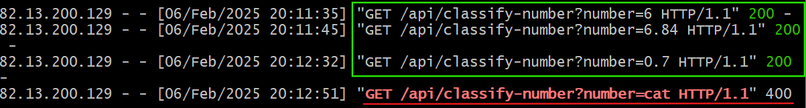

# Number Classification API 


This project is a simple API that takes a number and returns interesting mathematical properties about it, along with a fun fact.

**Features**

* ✅ Accepts a number a query parameter
* ✅Returns mathematical properties (prime, perfect, armstrong, even/odd)
* ✅ Fetches a fun fact about tthte number
* ✅ Returns data in JSON format
* ✅ Handles invalid inputs gracefully
* ✅ Supports Cross-Origin Resource Sharing (CORS)

**Tech Stack**
* Python (Flask) - API Development
* Flask-CORS - Handling Cross-Origin requests
* Request - Fetching fun facts from Number API
* AWS EC2 (Ubuntu) - Deployment
* Github - Version Control

### Setup Instructions

1. **Install Python 3 and Virtual Environment (Local PC - Ubuntu/Linux).**

Before writing the API, I first ensured Python 3 was installed on my local machine. To check if python is installed, run:

`python3 --version`

If Python is not installed, install it using:

`sudo apt update sudo apt install python3 python3-pip python3-venv`

2. **Set Up a Virtual Environment**
A virtual environment keeps dependencies isolated. I created one using:

`python3 -m venv number-classify-env source number-classify-env/bin/activate`

3. **Install Flask and Dependencies**
Inside the virtual environment, I installed the required libraries:

`pip install flask flask-cors requests`

4. **Write the Python Script for the API**
I created a new file called index.py and wrote the code, which is attached to this repository.

5. **Test the API Locally**.

I ran the Flask app using:

`python3 index.py`

The API was accessible at:

`http://3.90.168.74:5000/api/classify-number?number=6`

I tested different numbers to ensure the classification and fun fact retrieval were working properly.

6. **Push the Code to GitHub**

### Deployment on AWS EC2

1. **Launch an EC2 Instance**

I created an Ubuntu 20.04 EC2 instance on AWS. Allowed SSH (port 22) and HTTP (port 80) in security groups. Connected via SSH:

`ssh -i <your-private-key.pem> ubuntu@`

2. **Install Python and Dependencies on EC2**

I updated the system and installed Python 3:

```
sudo apt update && sudo apt upgrade 
sudo apt install python3-pip python3-venv git nginx
```

3. **Set Up Virtual Environment on EC2**
```
python3 -m venv number-classify-env source number-classify-env/bin/activate pip install flask flask-cors requests
```

5. **Run the API on EC2**

`python3 app.py`

I accessed the API using:

http://3.90.168.74:5000/api/classify-number?number=6


6. **Set up a Reverse Proxy with Nginx**

To make the API publicly accessible, I configured Nginx:

`sudo vim /etc/nginx/sites-available/default`

and updated it as seen below

```
server {
    listen 80;
    location / {
        proxy_pass http://127.0.0.1:5000;
        proxy_set_header Host $host;
        proxy_set_header X-Real-IP $remote_addr;
        proxy_set_header X-Forwarded-For $proxy_add_x_forwarded_for;
        proxy_set_header X-Forwarded-Proto $scheme;
    }
}
```

I saved and restarted nginx.

`sudo systemctl restart nginx`

7. **Testing invalid inputs**

I tested invalid input such as alphabet and error response (400 Bad request) as intended with the below error message, confirming the code working as intended.

http://3.90.168.74:5000/api/classify-number?number=apple


### Final Notes

This API is successfully implemented using Flask and supports Cross-Origin Resource Sharing (CORS). It achieves a response time of less than 500ms, ensuring efficient performance. The API handles errors gracefully, returning a 400 Bad Request for invalid inputs and a 200 OK response for valid integers. With all requirements met, this project is considered successfully completed.



